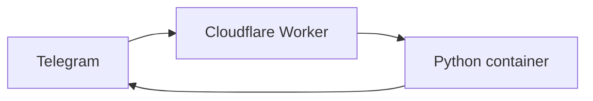

<div align="center">

## 📑 ✍️

# Slides Converter Bot

Self-host a Telegram bot that turns slide PDFs into A4 note pages.

[Quick start](#quick-start) · [Deploy](#deploy) · [Development](#development)

</div>

> [!NOTE]
> Bring your own Telegram bot and Cloudflare account. An allowlist controls
> access.

## How it works



The Worker authenticates requests. The container downloads each PDF, places
three slides beside dotted notes, and replies with
`<original-name>-notes.pdf`. Failed jobs ask the user to retry.

> [!IMPORTANT]
> PDFs are limited to 20 MB in and 50 MB out. One `basic` container handles
> jobs without a queue or automatic retries.

## Requirements

- Python 3.12+, [uv](https://docs.astral.sh/uv/), and Node.js 20+
- Docker
- Cloudflare Workers Paid plan with Containers
- Telegram bot token from [BotFather](https://t.me/BotFather)

## Quick start

```bash
git clone https://github.com/oadultradeepfield/slides-converter-bot.git
cd slides-converter-bot
make install
cp .dev.vars.example .dev.vars
```

Add your credentials and comma-separated Telegram user IDs to `.dev.vars`:

```env
TELEGRAM_BOT_TOKEN=123456:replace-me
TELEGRAM_WEBHOOK_SECRET=replace-with-random-secret
ALLOWED_TELEGRAM_USER_IDS=123456789,987654321
```

```bash
make check
npm run dev
```

## Deploy

```bash
npx wrangler login
npx wrangler secret put TELEGRAM_BOT_TOKEN
npx wrangler secret put TELEGRAM_WEBHOOK_SECRET
npx wrangler secret put ALLOWED_TELEGRAM_USER_IDS
npm run deploy
```

Register the Worker as your Telegram webhook:

```bash
curl --request POST "https://api.telegram.org/bot${TELEGRAM_BOT_TOKEN}/setWebhook" \
  --data-urlencode "url=https://slides-converter-bot.<workers-subdomain>.workers.dev/telegram" \
  --data-urlencode "secret_token=${TELEGRAM_WEBHOOK_SECRET}" \
  --data-urlencode 'allowed_updates=["message"]'
```

## Development

| Command | Purpose |
| --- | --- |
| `make fmt` | Format and auto-fix Python |
| `make lint` | Check Python formatting and lint |
| `make types` | Run strict mypy |
| `make test` | Run pytest |
| `make worker-check` | Type-check the Worker |
| `make check` | Run every check |
| `make install-hooks` | Install the pre-commit hook |

## License

Released under the [MIT License](LICENSE).
